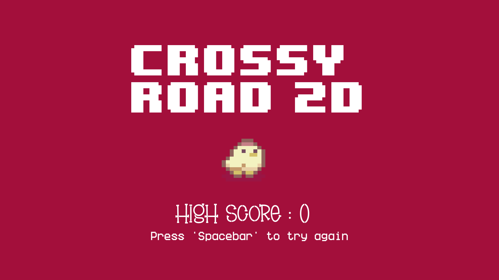
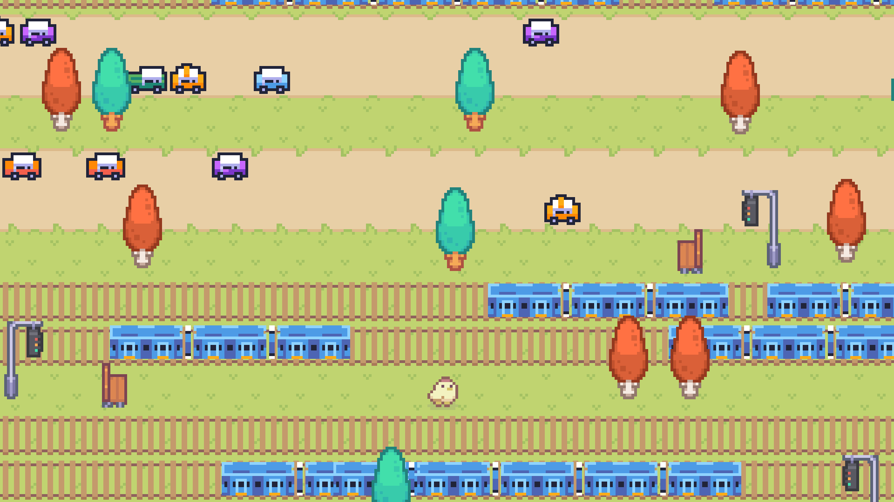
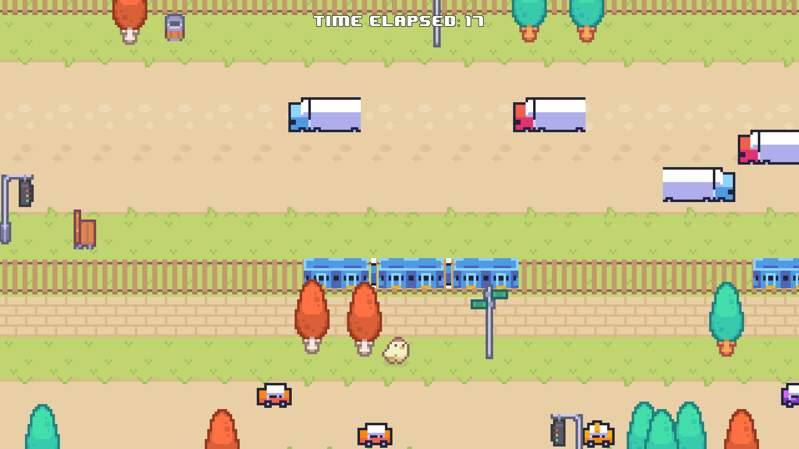
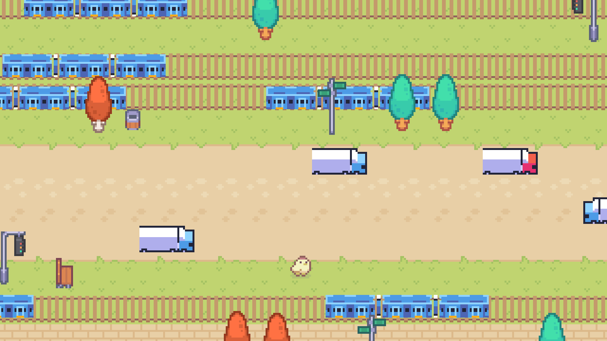

<h1 align="center">🐔 Crossy Road 2D</h1>

<p align="center">
  
</p>

<p align="center">
  
  
  
</p>

<p align="center">
  <strong>A simple 2D arcade game inspired by Crossy Road, built with Godot Engine and GDScript.</strong>
</p>

<p align="center">
  🎮 Dodge traffic • 🚂 Avoid trains • 🏆 Beat your high score
</p>

---

## 📖 Overview

This project recreates some of the core gameplay mechanics of Crossy Road in a 2D environment. Players must navigate through obstacles, avoid hazards, and travel as far as possible while achieving the highest score.

---

## ✨ Features

<table>
<tr>
<td>✅ 2D Grid-Based Movement</td>
<td>✅ Obstacle Avoidance</td>
</tr>
<tr>
<td>✅ Score Tracking System</td>
<td>✅ Multiple Hazards</td>
</tr>
<tr>
<td>✅ Custom UI</td>
<td>✅ Built with Godot & GDScript</td>
</tr>
</table>

---

## 📸 Screenshots

<p align="center">
  
  
  
</p>

<p align="center">
  <em>Gameplay, obstacle avoidance, and scoring mechanics.</em>
</p>

---

## 🛠️ Technologies Used

<p align="center">
  
  
</p>

---

## 🚀 Getting Started

### Clone the Repository

```bash
git clone https://github.com/uttiyapal/Crossy-Road-2D.git
```

### Run the Project

1. Open the project in Godot.
2. Load the project folder.
3. Run the `game` scene.

---

## 🎨 Assets

### Sprites & Tilesets

* Sprout Lands Asset Pack
  https://cupnooble.itch.io/sprout-lands-asset-pack

* Crossy Road 2D Sprites
  https://thdudk.itch.io/crossy-road-2d-sprites

### Audio & Sound Effects

* Chicken Clucking Sound Effect
  https://pixabay.com/sound-effects/nature-047876-chicken-clucking-68610/

* Background Music
  https://pixabay.com/music/upbeat-inspiring-acoustic-folk-music-255650/

### Fonts

* Brownie Stencil
  https://www.fontspace.com/brownie-stencil-font-f107985

* 8-Bit Wonder
  https://www.dafont.com/8bit-wonder.font

---

## 🎓 Educational Purpose Notice

> This project has been developed **for educational purposes only**.
>
> It is intended as a learning exercise to explore game development concepts using the Godot Engine and GDScript.

Crossy Road is a trademark and property of its respective owners. This project is **not affiliated with, endorsed by, or associated with** the original creators or publishers of Crossy Road.

---
